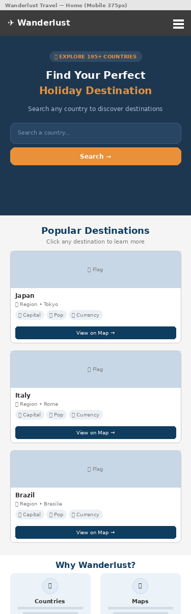
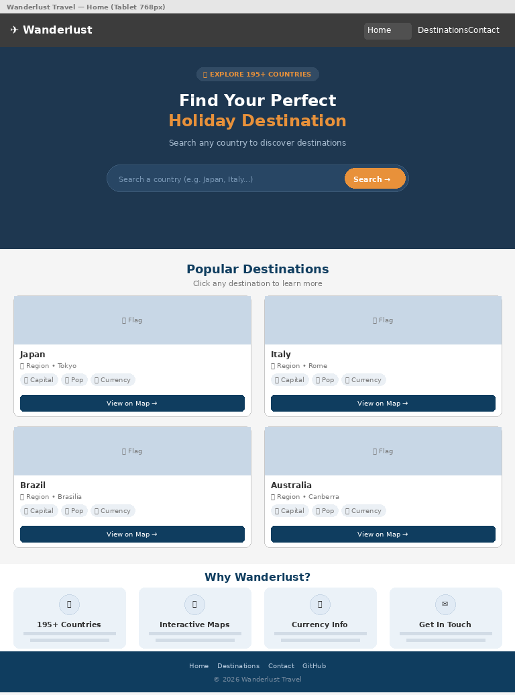
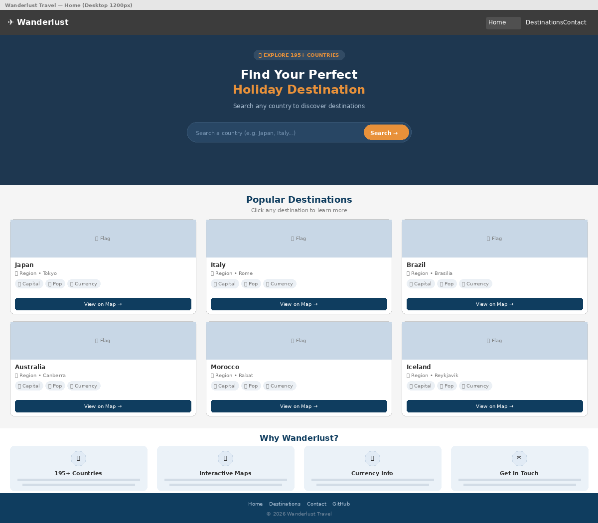
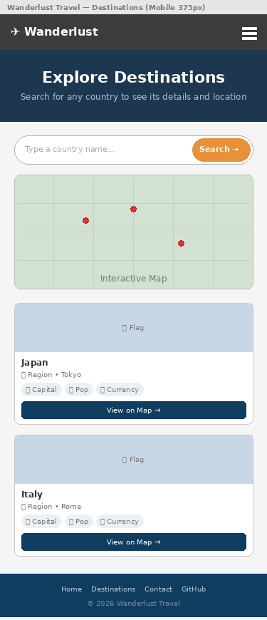
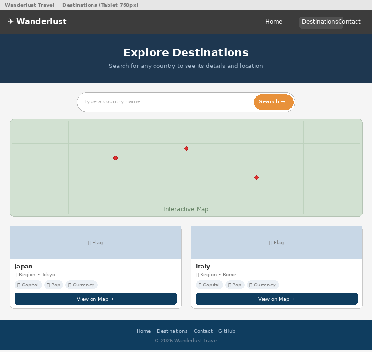
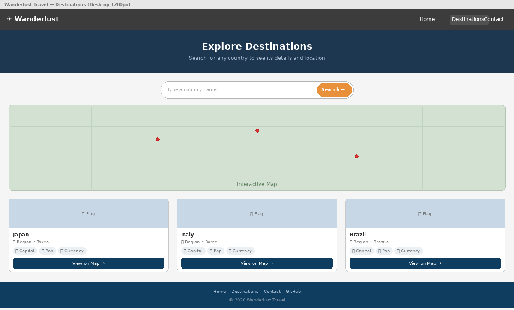
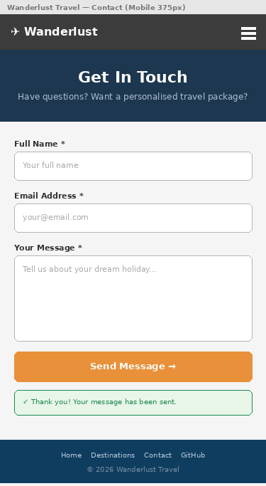
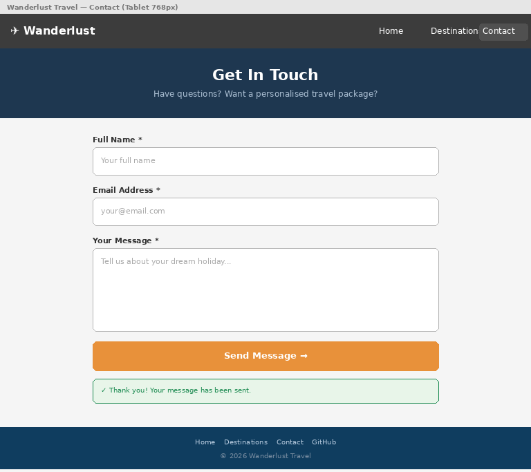
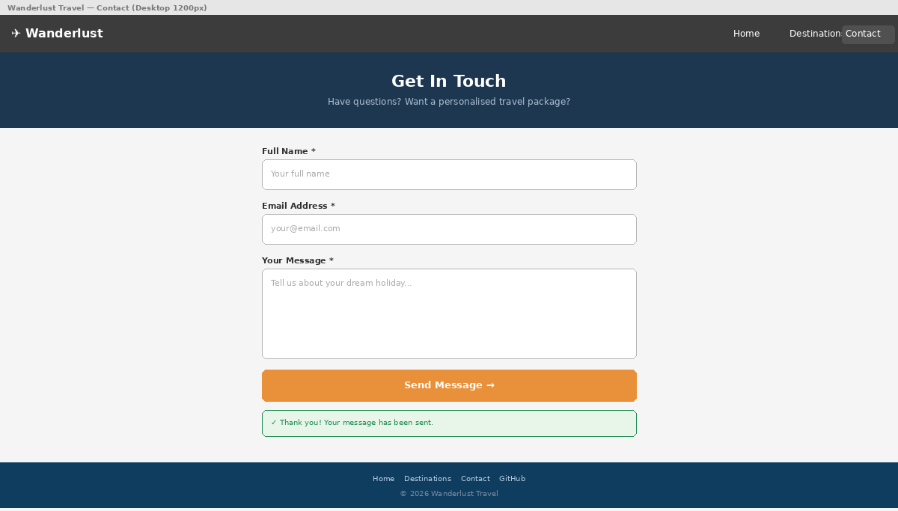

# Wanderlust Travel - Holiday Destination Finder


**Live Site:** [https://timothyosaigbovo.github.io/wanderlust-travel/](https://timothyosaigbovo.github.io/wanderlust-travel/)

**Repository:** [https://github.com/timothyosaigbovo/wanderlust-travel](https://github.com/timothyosaigbovo/wanderlust-travel)

Wanderlust Travel is an interactive front-end web application that helps users discover holiday destinations worldwide. Users can search for any country to view key information such as capital city, population, currency, and languages, displayed alongside an interactive map powered by Leaflet.js and real-time data from the REST Countries API.

This project was built as Milestone Project 2 (Interactive Frontend Development) for the Code Institute Level 5 Diploma in Web Application Development.

---

## Table of Contents

- [User Experience (UX)](#user-experience-ux)
  - [Project Goals](#project-goals)
  - [Target Audience](#target-audience)
  - [User Stories](#user-stories)
  - [Wireframes](#wireframes)
  - [Design Choices](#design-choices)
- [Features](#features)
  - [Existing Features](#existing-features)
  - [Future Features](#future-features)
- [Technologies Used](#technologies-used)
- [Testing](#testing)
- [Deployment](#deployment)
  - [GitHub Pages](#github-pages)
  - [Forking the Repository](#forking-the-repository)
  - [Cloning Locally](#cloning-locally)
- [Credits](#credits)

---

## User Experience (UX)

### Project Goals

The primary goal of Wanderlust Travel is to provide an engaging, easy-to-use tool for travellers to research and discover holiday destinations. The application aims to:

- Allow users to search for any country and instantly view relevant travel information
- Display countries on an interactive map for visual context
- Provide a responsive, accessible experience across all devices
- Offer a contact form for users to request personalised travel packages
- Demonstrate proficiency in HTML, CSS, and JavaScript with external API integration

### Target Audience

- Travellers planning holidays who want quick country information at a glance
- People who enjoy exploring different countries and cultures online
- Users who prefer visual, map-based exploration over text-heavy travel sites
- Anyone looking for a simple, fast way to compare destinations

### User Stories

#### First-Time Visitor Goals
1. As a first-time visitor, I want to understand the purpose of the site immediately so I can decide if it is useful to me.
2. As a first-time visitor, I want to search for a country and see relevant travel information so I can research potential destinations.
3. As a first-time visitor, I want to see the country on a map so I can understand where it is located geographically.
4. As a first-time visitor, I want the site to be easy to navigate so I can find information quickly.
5. As a first-time visitor, I want the site to work on my mobile phone so I can browse while on the go.

#### Returning Visitor Goals
6. As a returning visitor, I want to explore featured destinations for travel inspiration.
7. As a returning visitor, I want to contact the site owners to ask about personalised travel packages.
8. As a returning visitor, I want to search for multiple countries to compare destinations.

#### Site Owner Goals
9. As the site owner, I want to showcase popular destinations to inspire users to travel.
10. As the site owner, I want users to be able to contact me through a validated form so I receive genuine enquiries.
11. As the site owner, I want the site to be accessible to all users, including those using screen readers.

### User Stories Fulfilment

| # | User Story | How It Is Met | Screenshot |
|---|-----------|---------------|------------|
| 1 | Understand purpose immediately | Hero section with clear heading "Find Your Perfect Holiday Destination" and search bar |  |
| 2 | Search for a country | Search bar on homepage and dedicated destinations page with real-time API results |  |
| 3 | See country on map | Interactive Leaflet.js map with markers and "View on Map" buttons on each card |  |
| 4 | Easy navigation | Consistent navbar across all pages with clear links and active page indicator |  |
| 5 | Works on mobile | Fully responsive design with hamburger menu tested on multiple devices |  |
| 6 | Featured destinations | Six popular destinations loaded on homepage (Japan, Italy, Brazil, Australia, Morocco, Iceland) |  |
| 7 | Contact the site | Validated contact form with name, email, and message fields |  |
| 8 | Compare destinations | Multiple results shown when searching partial names (e.g. "United" shows UK, US, UAE) |  |
| 9 | Showcase destinations | Featured destinations section on homepage with country cards |  |
| 10 | Validated contact form | Client-side validation for name (2+ chars), email (format check), message (10+ chars) |  |
| 11 | Accessible to all | Skip-to-content link, ARIA labels, semantic HTML, keyboard navigable, 94-96 accessibility scores |  |


### Wireframes

Wireframes were created for mobile, tablet, and desktop layouts to plan the structure and responsive behaviour of each page before development began.

| Page | Mobile | Tablet | Desktop |
|------|--------|--------|---------|
| Home |  |  |  |
| Destinations |  |  |  |
| Contact |  |  |  |

### Wireframes

Wireframes were created for ...

| Page | Mobile | Tablet | Desktop |
...

### Design Choices

The colour scheme was checked for WCAG AA contrast compliance to ensure readability for all users.


#### Colour Scheme

The colour palette was chosen to evoke trust, adventure, and warmth — key emotions associated with travel planning.

| Colour | Hex Code | Usage |
|--------|----------|-------|
| Deep Navy | #0F3D5F | Primary colour — navbar, headings, footer, buttons |
| Ocean Blue | #1A5C8A | Primary light — hover states, focus rings, links |
| Sunset Orange | #E8913A | Accent colour — call-to-action buttons, highlights |
| Warm Orange | #D07A28 | Accent hover state |
| Cloud White | #F4F8FB | Background surface colour |
| Dark Slate | #1E2D3D | Main text colour |
| Muted Blue | #5A7186 | Secondary text, captions |

The colour scheme was checked for WCAG AA contrast compliance to ensure readability for all users.

#### Typography

Two Google Fonts were chosen for clear readability and modern aesthetics:

- **Poppins** (headings) — A geometric sans-serif with strong visual weight, providing clear hierarchy for headings and titles
- **Open Sans** (body text) — A humanist sans-serif designed for excellent legibility on screens at all sizes

#### Rationale for Design Decisions

- **Card-based layout** was chosen because it allows users to scan multiple destinations quickly, with each card containing a consistent set of information
- **Interactive map integration** provides visual geographical context that static text cannot deliver
- **Mobile-first responsive design** ensures the majority of users (mobile) get a fully optimised experience
- **Loading spinners and feedback messages** keep users informed during API calls, reducing perceived wait time
- **Consistent navigation** across all pages reduces cognitive load and helps users find information quickly


## Features

### Existing Features

#### Navigation Bar
- Fixed position at the top of all pages for easy access
- Responsive hamburger menu on mobile devices with ARIA expanded state
- Active page indicator showing the current page
- Logo links back to homepage from any page

#### Hero Section with Search (index.html)
- Eye-catching gradient background with animated text entry
- Clear heading and subheading explaining the site purpose
- Prominent search bar with placeholder text guiding the user
- Search validates input before making API calls (empty, too short, invalid characters)

#### Country Search and Results
- Real-time search using the REST Countries API
- Loading spinner shown during API calls (progress indicator)
- Results displayed as cards showing: flag, country name, region, capital, population, currency, and languages
- Error handling for no results, network errors, and invalid input
- "View on Map" button on each card flies the map to that country
- AbortController cancels stale requests when user searches again quickly (prevents race conditions)

#### Interactive Map
- Powered by Leaflet.js with OpenStreetMap tiles (free, no API key required)
- Map markers placed on each search result country
- Popup on each marker showing country name and capital
- Map automatically adjusts zoom to fit all markers
- Smooth fly-to animation when "View on Map" is clicked

#### Featured Destinations (index.html)
- Six popular destinations loaded automatically on page load
- Countries: Japan, Italy, Brazil, Australia, Morocco, Iceland
- Each loads independently — if one fails, the others still display (graceful degradation)

#### Contact Form (contact.html)
- Three validated fields: name (2+ characters), email (format check), message (10+ characters)
- Inline error messages appear under each invalid field
- Errors clear automatically when the user starts typing
- Loading state on submit button ("Sending...")
- Success message displayed after submission
- Prepared for EmailJS integration for real email sending

#### 404 Error Page
- Custom styled 404 page matching the site design
- Auto-redirect countdown from 10 seconds to homepage
- Manual "Back to Homepage" button for immediate navigation
- Served automatically by GitHub Pages for any non-existent URL

#### Accessibility Features
- Skip-to-content link for keyboard and screen reader users
- ARIA labels on all interactive elements (nav, search, buttons, alerts)
- Semantic HTML5 elements throughout (header, nav, main, section, footer)
- `aria-live="polite"` on feedback messages so screen readers announce changes
- Keyboard navigable — all interactive elements reachable via Tab key
- Focus visible states on all interactive elements

#### Back to Top Button
- Appears when user scrolls down more than 400px
- Smooth scroll animation to return to top
- Hidden at the top of the page to avoid clutter

### Future Features

- **Weather integration** — Show current weather for each destination using OpenWeather API
- **Flight search** — Link to flight comparison sites for each country
- **User favourites** — Allow users to save favourite destinations using local storage
- **Country comparison** — Side-by-side comparison of two selected countries
- **Travel advisories** — Display current travel warnings from government APIs
- **Multi-language support** — Translate the interface into multiple languages
- **EmailJS live integration** — Connect the contact form to send real emails

---

## Technologies Used

### Languages
- **HTML5** — Semantic markup and page structure
- **CSS3** — Styling, animations, responsive design with custom properties
- **JavaScript (ES8)** — Interactive functionality, API integration, DOM manipulation

### Frameworks, Libraries & APIs
- [Leaflet.js](https://leafletjs.com/) — Interactive maps with OpenStreetMap tiles
- [REST Countries API](https://restcountries.com/) — Free country data (no API key required)
- [EmailJS](https://www.emailjs.com/) — Client-side email sending (prepared for integration)
- [Google Fonts](https://fonts.google.com/) — Poppins and Open Sans typography

### Tools & Platforms
- [Visual Studio Code](https://code.visualstudio.com/) — Code editor
- [Git](https://git-scm.com/) — Version control
- [GitHub](https://github.com/) — Repository hosting and deployment
- [GitHub Pages](https://pages.github.com/) — Live site hosting
- [Chrome DevTools](https://developer.chrome.com/docs/devtools/) — Testing and debugging
- [W3C HTML Validator](https://validator.w3.org/) — HTML validation
- [W3C CSS Validator](https://jigsaw.w3.org/css-validator/) — CSS validation
- [JSHint](https://jshint.com/) — JavaScript validation
- [Google Lighthouse](https://developer.chrome.com/docs/lighthouse/) — Performance and accessibility auditing
- [Balsamiq](https://balsamiq.com/) — Wireframe creation

---

## Testing

Full testing documentation is available in the [TESTING.md](TESTING.md) file.

### Summary of Testing Performed
- **HTML Validation:** All 4 pages pass W3C validation with no errors
- **CSS Validation:** style.css passes W3C Jigsaw validation with no errors
- **JavaScript Validation:** Both JS files pass JSHint with no major issues
- **Manual Testing:** 42 test cases covering navigation, search, contact form, 404 page, and featured destinations — all passing
- **Responsiveness:** Tested across 6 device sizes from 375px to 1920px — all passing
- **Browser Compatibility:** Tested on Chrome, Firefox, and Edge — all passing
- **Lighthouse Scores:** All pages score 90+ in Performance, Accessibility, Best Practices, and SEO
- **Bugs:** 3 bugs found during development, all documented and fixed

---

## Deployment

### GitHub Pages

This project was deployed to GitHub Pages using the following steps:

1. Log in to [GitHub](https://github.com/) and navigate to the [wanderlust-travel repository](https://github.com/timothyosaigbovo/wanderlust-travel)
2. Click **Settings** (gear icon near the top of the repository page)
3. In the left sidebar, click **Pages**
4. Under **Build and deployment** > **Source**, select **Deploy from a branch**
5. Under **Branch**, select **main** and **/ (root)**
6. Click **Save**
7. Wait 2-5 minutes for the site to build
8. The live site URL will appear at the top: [https://timothyosaigbovo.github.io/wanderlust-travel/](https://timothyosaigbovo.github.io/wanderlust-travel/)

### Forking the Repository

1. Log in to GitHub and navigate to the [wanderlust-travel repository](https://github.com/timothyosaigbovo/wanderlust-travel)
2. Click the **Fork** button in the top right corner
3. This creates a copy of the repository in your own GitHub account
4. You can then clone your fork and make changes without affecting the original

### Cloning Locally

1. Log in to GitHub and navigate to the [wanderlust-travel repository](https://github.com/timothyosaigbovo/wanderlust-travel)
2. Click the green **Code** button
3. Copy the HTTPS URL: `https://github.com/timothyosaigbovo/wanderlust-travel.git`
4. Open your terminal and navigate to the folder where you want to clone the project
5. Run the following command:
```
   git clone https://github.com/timothyosaigbovo/wanderlust-travel.git
```
6. Open the project folder in your code editor
7. Open `index.html` with Live Server or directly in your browser

**Note:** This project uses free APIs that do not require API keys. No additional configuration is needed to run the project locally.

---

## Credits

### Code
- [Leaflet.js Documentation](https://leafletjs.com/reference.html) — Used for implementing the interactive map, markers, popups, and fly-to animations
- [REST Countries API](https://restcountries.com/) — Used for fetching country data including flags, capitals, population, currencies, and languages
- [MDN Web Docs](https://developer.mozilla.org/) — Referenced for JavaScript methods including `fetch`, `async/await`, `AbortController`, `addEventListener`, and DOM manipulation
- [CSS-Tricks](https://css-tricks.com/) — Referenced for CSS Grid, Flexbox layout techniques, and custom properties
- [EmailJS Documentation](https://www.emailjs.com/docs/) — Referenced for client-side email integration setup

### Content
- All text content was written by the developer for this project
- Country data (flags, population, capitals, currencies, languages) is provided in real-time by the REST Countries API
- Map tiles are provided by OpenStreetMap contributors

### Media
- Country flag images are served by the REST Countries API from the [Flagpedia](https://flagpedia.net/) project
- No other external images are used — the site uses CSS gradients and emoji icons for visual elements

### Acknowledgements
- Code Institute for the project brief, learning materials, and assessment criteria
- The Slack community at Code Institute for peer support and feedback
- My mentor for guidance throughout the project development process

---

*This project was created for educational purposes as part of the Code Institute Level 5 Diploma in Web Application Development.*